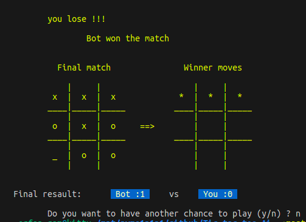

# Tic-tac-toe-Ai :game_die:
written by [kity-cat :octocat:](https://github.com/Erfan-ram)

will find best move depends on hardness (Hard , intermediate and easy)

using minimax algorithm (develop intermediate and easy) for game artificial intelligence

<div id="header" align="center">
  
</div>

# Run tic tac toe

First clone this repository to your local storage

```bash
  git clone https://github.com/Erfan-ram/Tic-tac-toe-Ai.git

  ╰─➤  cd  Tic-tac-toe-Ai

```
you would have 2 choices to continue
- [Using makefile](#makefile) :sunglasses:
- [Using code](#quick-run) :monocle_face:
<br><br/>
# Makefile <a id="makefile"></a>
To run this project using makefile first istall make

```bash
  sudo apt install make
```
After cloning and open directory it's time to run project

```bash
  make
```

After this a file name `tic-tac-toe` will appear . you just need to run program using 
```bash
make run
```
**or**
```bash
./tic-tac-toe
```
> i optimized Makefile to run the program using `make run` 
> - if you want to develop it or test your code you can locate your codes on **Makefile** line 19

also you can clean complied `.o` output files using 
```bash
make clean
```
<br><br/>
# Quick run <a id="quick-run"></a>
you can run below code without being involved with make :smiling_face_with_tear:
```bash
g++ start.cpp src/Main.cpp -o tic-tac-toe
╰─➤  ./tic-tac-toe                            
```

---
- if you are not familiar with clean coding and modules and headers or you are beginner at coding you can check `old-struct` branch that exclude header files . and it just need to run main.cpp